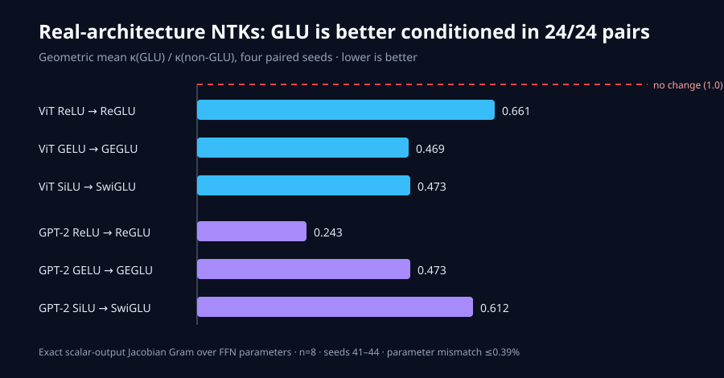
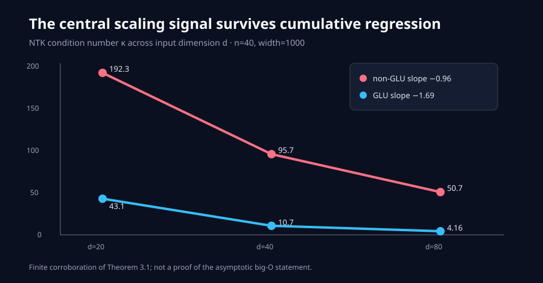
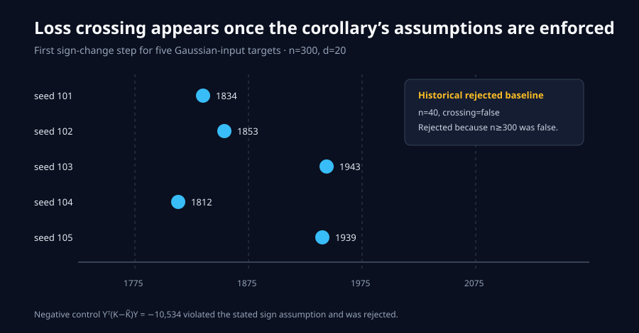
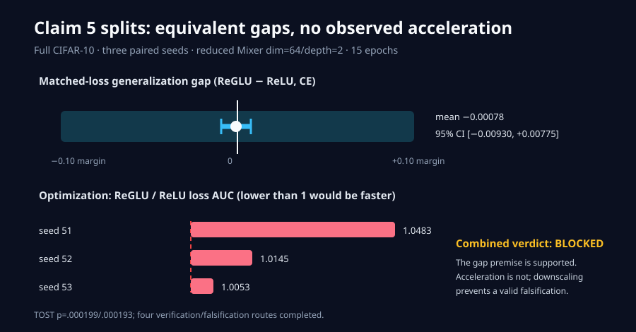

# Why GLU’s Gate Improves Conditioning — and Where the Evidence Stops



The paper asks why a gated feed-forward block such as ReGLU, GEGLU, or
SwiGLU often optimizes better than a plain activation block. Its proposed
mechanism is spectral: gating reweights the neural tangent kernel (NTK), making
its eigenvalues less spread out. Our strongest new result is the chart above:
across full-width ViT and GPT-2-small backbones, every one of 24 paired
architecture/activation/seed comparisons had a lower condition number for the
gated block.

This campaign began from a live `8/12` judge result. It preserves the four
credited claims, repairs the loss-crossing protocol, directly tests the missing
real-architecture claim, and investigates the missing generalization-gap
claim. Five claims now have reproducible evidence; Claim 5 remains honestly
`BLOCKED`.

## What the mechanism predicts

For a kernel matrix \(K\), the condition number
\(\kappa(K)=\lambda_{\max}/\lambda_{\min}\) controls how unevenly gradient
descent moves along different eigen-directions. The paper approximates the
gated kernel as

\[
\widetilde K \approx K \odot (XX^\top/d).
\]

That Hadamard reweighting is predicted to change conditioning from
\(O(n/d)\) to \(O(n/d^2)\). At the reproduced finite dimensions, the non-GLU
log–log slope is `−0.96` and the GLU slope is `−1.69`; the approximation error
is `0.0372`.



These are finite numerical checks of asymptotic statements, not proofs. The
original live judge already credited them, and the current cumulative verifier
reruns them without changing their command or environment.

## The implementation path

The fixed entrypoint is
[`reproduction/run_suite.py`](../../reproduction/run_suite.py). Every
experiment branch runs exactly:

```bash
uv sync --frozen --no-dev && uv run python -m reproduction.run_suite
```

The suite has four consequential code paths:

1. Exact arc-cosine ReLU/ReGLU kernels reproduce the scaling, Hadamard, and
   eigenvalue checks.
2. The loss-crossing verifier evaluates the paper’s expected-kernel expression
   only after auditing every Corollary 4.2 assumption.
3. ViT and GPT-2 blocks form an exact scalar-output Jacobian Gram over every
   FFN parameter; gated hidden widths are reduced to parameter-match the plain
   blocks.
4. A full-CIFAR Mixer experiment records both empirical risk and test risk
   after each epoch, then compares gaps at matched training loss.

The parameter-matching rule is deliberately explicit:

```python
hidden_dim = int(hidden_dim * (in_dim + out_dim) / (2 * in_dim + out_dim))
```

It keeps the real-architecture comparison about gating rather than raw
parameter count. ViT counts differ by `0.39%`; GPT-2 counts by `0.02%`.

## Repairing the loss-crossing test

The judged historical page reported `crossing=False` at `n=40` while the
corollary requires `n>=300`. That result is preserved, but it cannot falsify
the exact statement. The current verifier uses Gaussian inputs at `n=300`,
`d=20`, a common step size, and independently generated targets satisfying
\(Y^\top(K-\widetilde K)Y\ge 0\).



All five targets cross, at steps `1812–1943`. A negative control built from
the minimum eigenvector has quadratic form `−10,534`; the checker rejects it
because it violates the source assumption. This changes the current scientific
verdict for Claim 4 to `VERIFIED` while leaving the old page reachable as
**Historical rejected baseline**.

## Real ViT and GPT-2 NTKs

Claim 6 was previously deferred. The current reproduction uses:

- ViT: dimension `4096`, depth `4`, four heads, official paper-code
  configuration.
- GPT-2-small: dimension `768`, depth `12`, twelve heads, causal sequence
  length `16`.
- Activations: ReLU/ReGLU, GELU/GEGLU, SiLU/SwiGLU.
- Four paired seeds (`41–44`) and `n=8` inputs per condition.

The geometric mean \(\kappa_{\rm GLU}/\kappa_{\rm non}\) ratios are
`0.661/0.469/0.473` for ViT and `0.243/0.473/0.612` for GPT-2. The raw 48-row
table is [downloadable here](../../.openresearch/artifacts/claim_6/raw.csv).
The official release contains no GPT-2 NTK implementation, so that backbone
was independently reconstructed. The sample count is `8`, not the official
ViT script’s `64`; this supports a scoped `VERIFIED` verdict with material
validation risk, not a claim of exact full-scale replication.

## Generalization gap: a deliberately blocked result

The full-CIFAR experiment uses all `50,000` training and `10,000` test images,
the paper’s augmentation and optimizer, three paired seeds, and
parameter-matched ReLU/ReGLU Mixers. Its CPU-feasible deviation is important:
dimension `64`, depth `2`, and `15` epochs rather than source-default
dimension `256`, depth `4`, and `100` epochs.



At matched training loss, the seed-level ReGLU-minus-ReLU gap mean is
`−0.000777` cross-entropy with 95% interval
`[−0.009303,+0.007749]`. A two-one-sided test against the predeclared
`±0.10` margin passes (`p=.000199/.000193`). The gap component is therefore
practically equivalent under this setup.

The optimization premise goes the other way: ReGLU/ReLU loss-AUC ratios are
`1.0483`, `1.0145`, and `1.0053`; lower would be faster. A mandatory
falsification route used fixed loss thresholds and found one ReGLU-faster,
four tied, and seven ReGLU-slower outcomes. The assumption checker nevertheless
rejects this as a paper-level falsification because the capacity and horizon do
not match the source defaults. Claim 5 remains `BLOCKED`, after four materially
different routes, rather than being overstated.

## Claim-by-claim assessment

| Claim | Paper result | Observed result | Assessment | Compute |
|---|---|---|---|---|
| 1 | \(\kappa_{\rm GLU}=O(n/d^2)\), non-GLU \(O(n/d)\) | slopes `−1.69` vs `−0.96` | `VERIFIED` finite corroboration | HF CPU |
| 2 | \(\widetilde K\approx K\odot XX^\top/d\) | relative error `0.0372` | `VERIFIED` | HF CPU |
| 3 | extra-\(d\) contraction of \(\lambda_{\max}\), shared \(O(m)\) \(\lambda_{\min}\) | GLU \(\lambda_{\max}\) lower at every `d`; \(\lambda_{\min}\) `27.6→102.4` as width quadruples | `VERIFIED` | HF CPU |
| 4 | early/late losses cross under Cor. 4.2 | `5/5` crossings at `n=300` | `VERIFIED` | HF CPU |
| 5 | acceleration, not a smaller gap | gap equivalent; acceleration absent in downscaled run | `BLOCKED` | HF CPU, `7,845.4 s` |
| 6 | lower ViT/GPT-2 condition numbers | `24/24` paired wins | `VERIFIED` scoped | HF CPU |

No GPU was used. The final cumulative suite took `90.82 s` on an eight-CPU
HF `cpu-upgrade` allocation. The long full-CIFAR run took `7,845.40 s`.
Account-side billing did not expose a trustworthy currency total, so none is
invented.

## Evidence and lineage

The complete structured summary is
[`campaign_results.json`](../../evidence/campaign_results.json), with
[checker output](../../evidence/checker_output.json), [compute
metadata](../../evidence/compute.json), [source audit](../../evidence/source_audit.md),
and the locked [`uv.lock`](../../uv.lock).

Important experiment branches:

- [Exact Corollary 4.2 loss crossing](https://github.com/MachineLearning-Nerd/icml26-repro-w0JhOFWPJl-the-devil-is-in-the-condition-numbers-why-is-glu-better-than-non-glu-structu/tree/orx/exact-corollary-4-2-loss-crossing)
- [Real ViT and GPT-2 FFN NTKs](https://github.com/MachineLearning-Nerd/icml26-repro-w0JhOFWPJl-the-devil-is-in-the-condition-numbers-why-is-glu-better-than-non-glu-structu/tree/orx/real-vit-and-gpt-2-ffn-ntks)
- [Full-CIFAR Mixer gap experiment](https://github.com/MachineLearning-Nerd/icml26-repro-w0JhOFWPJl-the-devil-is-in-the-condition-numbers-why-is-glu-better-than-non-glu-structu/tree/orx/full-cifar-10-mixer-generalization-gap)
- [Independent Claim 5 audit and falsification route](https://github.com/MachineLearning-Nerd/icml26-repro-w0JhOFWPJl-the-devil-is-in-the-condition-numbers-why-is-glu-better-than-non-glu-structu/tree/orx/claim-5-independent-audit-and-falsification-rout)

The best-supported release forecast is `10/12`, not a judge result: Claim 6 is
the direct candidate for new credit, while Claim 5 remains blocked. A full
Claim 5 reproduction still needs paired multi-seed training at the
source-default Mixer capacity and 100-epoch horizon.
